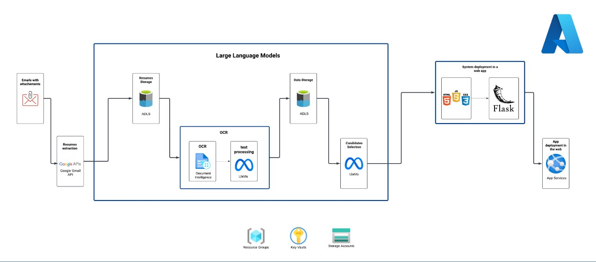

# 🚀 Azure-Powered HR Chatbot Assistant

## 📖 Project Description
This project leverages **Azure Cloud Services** and **Large Language Models (LLMs)** to revolutionize the HR recruitment process. By automating CV analysis and ranking, this solution aligns candidate profiles with job requirements, reducing time-to-hire and improving decision-making.

---

## 🏗️ Architecture Overview
The system integrates a wide range of tools and services, orchestrated to deliver seamless performance. Below is the high-level architecture:

 <!-- Replace with the correct path to your image -->

### 🔧 Components and Tools
1. **📧 Emails with Attachments**:
   - Source of candidate resumes for processing.

2. **📥 Resume Extraction**:
   - **Google Gmail API**: Fetches emails and extracts CV attachments.

3. **📂 Resume Storage**:
   - **Azure Data Lake Storage (ADLS)**: Securely stores extracted resumes.

4. **🔍 OCR and Text Processing**:
   - **Document Intelligence (OCR)**: Extracts text from CVs for further analysis.
   - **LLaMa**: Analyzes and extracts key insights from resumes using state-of-the-art NLP techniques.

5. **📊 Data Storage**:
   - **ADLS**: Stores structured data for candidate evaluation.

6. **🤖 Candidate Selection**:
   - **LLaMa**: Ranks candidates based on job requirements.

7. **🌐 System Deployment in a Web App**:
   - **Frontend**: Built with **HTML**, **CSS**, and **JavaScript**.
   - **Backend**: Powered by the lightweight **Flask** framework.

8. **☁️ Application Deployment**:
   - **Azure App Services**: Seamlessly hosts the web application for end-user interaction.

### 🌐 Azure Resources Used
- **Resource Groups**: Logical organization of resources.
- **Key Vaults**: Secure management of sensitive credentials.
- **Storage Accounts**: Reliable storage solution for large datasets.

---

## 🛠️ Project Phases
The project workflow is divided into four streamlined phases:

### **Phase 1: Data Extraction** 📧
- Automates the retrieval of resumes from emails using the **Gmail API**.

### **Phase 2: OCR and Text Processing** 🔍
- Converts resumes to text using **Document Intelligence (OCR)**.
- Extracts and processes relevant details with **LLMs**.

### **Phase 3: Chatbot for Candidate Selection** 🤖
- Implements an intelligent chatbot to rank and recommend candidates.

### **Phase 4: Application Deployment** 🚀
- Deploys the application on **Azure App Services**, making it accessible via a user-friendly interface.

---

## 🚀 Setup and Testing
Follow these steps to set up and test the project:

### 🛑 Prerequisites
- Active **Azure subscription**.
- Access to the **Google Gmail API**.
- Python environment with **Flask** installed.

### ⚙️ Setup Steps
1. **Clone the repository**:
   ```bash
   git clone https://github.com/your-repo-url.git
   cd your-repo-directory

   
2. Create a virtual environment:
   ```bash
   python -m venv venv
   source venv/bin/activate  # On Windows: venv\Scripts\activate

3. Install dependencies:
   ```bash
   pip install -r requirements.txt

4. Replace environment-specific values:
   - Open the .env file in the project directory.
   - Replace placeholders with your specific values (e.g., Azure keys, API credentials).
   
5. Replace the credentials file:
   - Copy your credentials file (e.g., credentials.json) and replace the existing placeholder file in the project.

6. Run the application:
   ```bash
   python app.py
